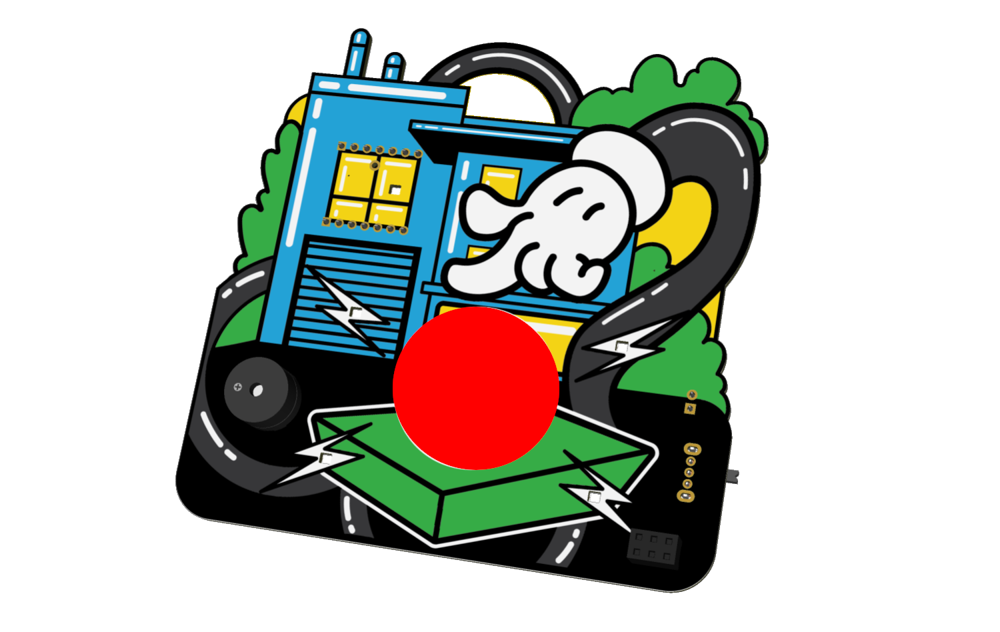
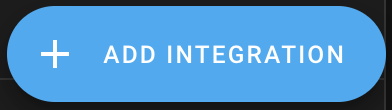

## 🚨 FirstBuild DefCon 33 Badge 🚨

<p align="center">
  
</p>

### Link to Badge GitHub Repo:
<p align="center">
  
  </br>
  Link To FirstBuild DefCon33 Badge GitHub Repo
</p>

### Schematic
You can find the [schematic for the FirstBuild Defcon33 Badge](https://github.com/FirstBuild/1B-DefCon33-Badges/Resources/BadgeSchematic.pdf) in the Resources folder. 

### Creating Files
If starting from scratch, create an initial YAML called `1b-defcon-badge-00.yaml` in the folder named `YAMLs`. Once you have an initial YAML to use as a template, run `python3 GenerateYAMLs.py` to generate the remaining YAMLs based on the template. This script will generate a unique API encryption key for each badge.

### Compiling and Uploading
In order to compile and upload badge firmware using the scripts included in this repo, you will need to have the ESPHome CLI installed. Follow [this guide](https://esphome.io/guides/installing_esphome.html) for instructions. 

Once you have generated the YAMLs, you can compile the badge firmware by navigating to the YAMLs folder and running `../Compile.sh 00 99`, where `00` is the first badge you want to compile and `99` is the last badge you want to compile. To upload, simply run `../Upload.sh 00 99` to upload the same range of YAMLs. 

### Adding to HomeAssistant
In order to add your badge to the FirstBuild Defcon33 Home Assistant Instance, first connect to the designated WiFi network (either the LVCC WiFi or our local SSID `1B DefCon`). Then navigate to [homeassistant-1b-defcon-1.local](http://homeassistant-1b-defcon-1.local/) to access our Home Assistant instance. The login uses `firstbuild` for both the username and password. 

Once in Home Assistant, go to ESPHome Builder in the left side navigation bar. Then find your badge number and click Edit. If the badge shows offline, make sure the power switch is in the ON position. You should hear a tune when you press the red button, if the badge is powered on. If it still shows offline, or if you have not had a badge assigned to you, see Bobby or Tim at the GE Appliances/FirstBuild area in the IoT Village. 

<p align="center">
  
</p>

Once you have found your badge in ESPHome Builder, click Edit. Then look for the encryption key. It will be under the `api` section. 

```
api:
  encryption:
    key: "gHbJPlbbefTITGReXtvSMNYOjHQvWWMmzPIUQfCxDo0="
```

Copy the encryption key to your clipboard (not the one shown above). Then go to Settings in Home Assistant and click Devices and Services. There you should see your badge number. Click the Add button. 

Once logged in, go to Settings in Home Assistant and click Devices and Services. There you may see your badge number. If you do, click the Add button.

<p align="center">
  
</p>

If you don't see your badge in Devices and Services, click Add Integration.

<p align="center">
  
</p>

After clicking Add Integration, search for ESPHome and click it.

<p align="center">
  
</p>

Then, enter the IP Address of your badge and click Submit. If you need help finding your IP address, ask Bobby or Tim.

<p align="center">
  
</p>

Next, you should see a screen with the name of your badge. Select Badges for the area name and click Finish.

<p align="center">
  
</p>

<!-- After clicking Add, click Submit on the next screen.

<p align="center">
  
</p>

Keep the default values for the connection settings and click Submit.

<p align="center">
  
</p>

On the next screen, select "Badges" in the Area dropdown and click Finish.

<p align="center">
  
</p> -->

Once you've added your badge, you should be able to see it in the Dashboard. From there, you can begin interacting with your badge and our appliances in HomeAssistant. Be sure to show anything that you build to Bobby or Tim.

### After the Con
After the Con, you can come back here and modify the YAML for your badge to make it connect to your WiFi network and HomeAssistant instance. 

Also, don't forget about that other board that came with your badge! It allows you to use the Xiao ESP32-C3 microcontroller that was included with your badge to connect your GE Appliances device to your HomeAssistant instance. Check out [the repo for the HomeAssistant Adapter](https://github.com/geappliances/home-assistant-adapter) to program it. 

<p align="center">
  
  </br>
  Link To HomeAssistant Adapter GitHub Repo
</p>

Want to use your badge and your HomeAssistant adapter at the same time? You'll just need to [buy another Xiao ESP32-C3 board](https://www.seeedstudio.com/Seeed-XIAO-ESP32C3-p-5431.html) so you can run both.

We REALLY want to see what you do with this stuff. Did you create something cool? Send an email to Bobby@FirstBuild.com or Tim@FirstBuild.com and show it off!

### Artwork
The amazing artwork for the FirstBuild DefCon33 badge was done by Phil Back.